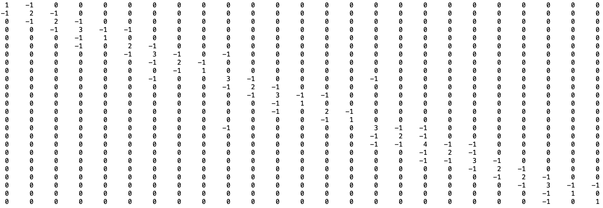
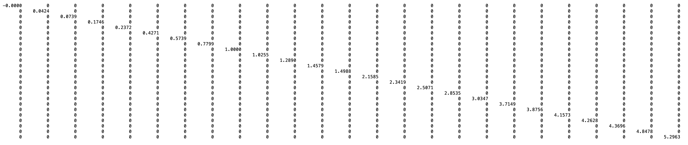
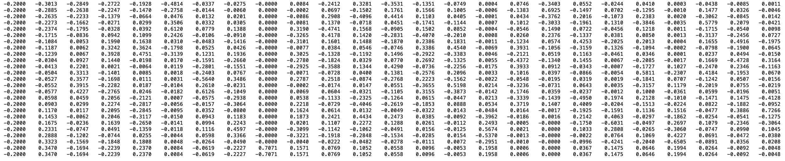

# LinAlg-NetworkAnalysis
This repository is for the code I wrote for my linear algebra project and the full calculations. Written in MATLAB. 

## About
This project will study the connectedness between high-speed train stations in Japan. This project will see how the fielder set reveals sections of train stations that are more split and isolated from the rest of the network. Note: I took the railway stations and tracks from real-world data, but the network analysis, from my knowledge, is unique. 

## Calculations

**Full 25x5 Laplacian Matrix**

**Full Eigenvalue Matrix**

**Full Eigenvector Matrix**

## Sources
1. [Map of Japanese Bullet Train Network](https://www.japanstation.com/map-of-shinkansen-high-speed-train-network-in-japan/)
2. [Additional Reading on Laplacian Matrices](https://en.wikipedia.org/wiki/Laplacian_matrix)

